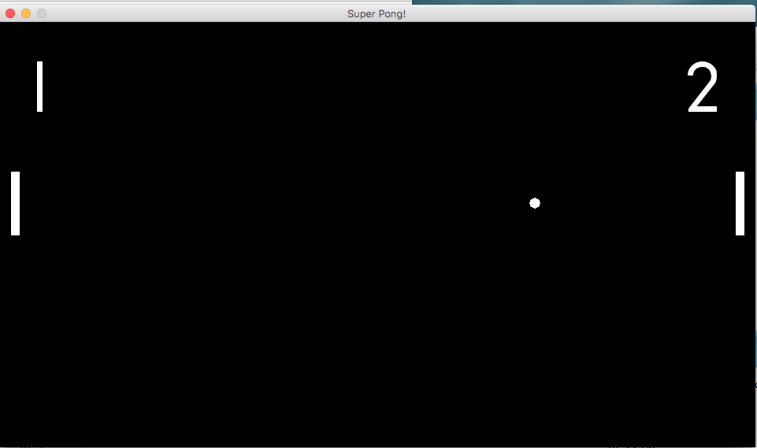

# Super Pong
Super pong is a two player pong game written in Python and uses [Pygame](https://www.pygame.org/)

Super pong has a few twists, such as the players can rotate the paddles to adjust the trajectory of the ball. The ball can also spawn "power ups" such as:
* Causing a paddle to become larger upon striking it
* Speed up the ball
* Flash the background (epilepsy warning) to distract opponent

## Controls 
(Player one uses WASD, player two uses arrow keys)
* Spacebar to start
* Paddle up: W (Up arrow)
* Paddle down: S (Down arrow)
* Rotate paddle backward: A (Left arrow)
* Rotate paddle forward: D (Right arrow)

## Requirements
* Python 3
* Pygame `python3 -m pip install -U pygame --user`

This project uses the [Airstrike](https://www.dafont.com/airstrike.font) font by [Iconian Fonts](http://www.iconian.com/)